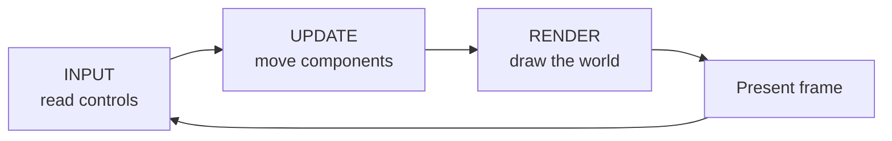

# Your first bunny game

In this tutorial you will open a window, spawn one bunny, move it with the
keyboard, and draw it every frame. The result is small, but it uses the same
pieces as a larger Arepy game.

{ .arepy-screenshot }
<p class="arepy-caption">The finished example. Use WASD or the arrow keys, click to move the bunny, and use the mouse wheel to resize it.</p>

The complete version shown in the screenshot also adds click-to-place, mouse
wheel scaling, a gradient, and the control panel. It lives in
[`examples/getting_started.py`](https://github.com/Scr44gr/arepy/blob/main/examples/getting_started.py).

## 1. Create the engine and a world

Create `main.py` beside an `assets` folder containing `bunny.png`:

```text
my-game/
├── assets/
│   └── bunny.png
└── main.py
```

If you cloned Arepy, copy
[`examples/assets/bunny.png`](https://github.com/Scr44gr/arepy/raw/main/examples/assets/bunny.png)
into that folder. You may use your own 32×32 PNG instead; keep its filename and
source rectangle in the code consistent.

Start with the engine shell:

```python
from arepy import ArepyEngine, SystemPipeline


engine = ArepyEngine(
    title="My first Arepy game",
    width=960,
    height=540,
    max_frame_rate=144,
)
world = engine.create_world("main")
```

Think of a `World` as a scene: a menu, a level, or a battle. It owns the
entities and systems that belong to that scene.

## 2. Describe the player with components

An entity is only an identity. Components give that identity data.

```python
from arepy.bundle.components import RigidBody2D, Sprite, Transform
from arepy.ecs import Component
from arepy.math import Vec2


class Player(Component):
    def __init__(self, speed: float = 260.0) -> None:
        super().__init__()
        self.speed = speed


player = (
    world.create_entity()
    .with_component(Transform(position=Vec2(464.0, 254.0)))
    .with_component(RigidBody2D(velocity=Vec2(0.0, 0.0)))
    .with_component(Sprite("bunny", (0, 0, 32, 32), z_index=1))
    .with_component(Player())
    .build()
)
```

The entity is the player because it has a `Player` component. It can move
because it has a `RigidBody2D`, and it can be placed and drawn because it has
`Transform` and `Sprite`.

## 3. Read the keyboard

A system is a regular Python function. Its query says which entities it can
work with, and its other typed arguments are services supplied by Arepy.

```python
from arepy import Input, Key
from arepy.ecs import Entity, Query, With


def read_controls(
    query: Query[Entity, With[Player, RigidBody2D]],
    input_device: Input,
) -> None:
    for player, rigid_body in query.iter_components(Player, RigidBody2D):
        horizontal = float(
            input_device.is_key_down(Key.D)
            or input_device.is_key_down(Key.RIGHT)
        ) - float(
            input_device.is_key_down(Key.A)
            or input_device.is_key_down(Key.LEFT)
        )
        vertical = float(
            input_device.is_key_down(Key.S)
            or input_device.is_key_down(Key.DOWN)
        ) - float(
            input_device.is_key_down(Key.W)
            or input_device.is_key_down(Key.UP)
        )

        # Reuse the existing Vec2 instead of replacing it every frame.
        rigid_body.velocity.x = horizontal * player.speed
        rigid_body.velocity.y = vertical * player.speed
```

`is_key_down()` stays true while a key is held. That makes it the right choice
for continuous movement. Use `is_key_pressed()` for one-shot actions such as
opening a menu or firing once.

## 4. Move the matching entities

```python
from arepy import Time


def move_player(
    query: Query[Entity, With[Transform, RigidBody2D]],
    time: Time,
) -> None:
    for transform, rigid_body in query.iter_components(
        Transform,
        RigidBody2D,
    ):
        transform.position.x += rigid_body.velocity.x * time.delta_seconds
        transform.position.y += rigid_body.velocity.y * time.delta_seconds

        transform.position.x = min(max(transform.position.x, 24.0), 904.0)
        transform.position.y = min(max(transform.position.y, 92.0), 484.0)
```

Multiplying by `time.delta_seconds` makes movement independent of frame rate.
The code mutates the existing vector coordinates, so it does not create a new
`Vec2` for every entity on every frame.

## 5. Load once, draw every frame

Load the texture before the game loop:

```python
from pathlib import Path

from arepy import Color, Rect, Renderer2D
from arepy.asset_store import AssetStore


assets = engine.get_asset_store()
renderer = engine.renderer_2d
texture_path = Path(__file__).parent / "assets" / "bunny.png"
assets.load_texture(renderer, "bunny", str(texture_path))


@world.on_shutdown
def unload_bunny() -> None:
    assets.unload_texture(renderer, "bunny")

BACKGROUND = Color(13, 18, 30, 255)
WHITE = Color(245, 247, 255, 255)
SOURCE = Rect(0.0, 0.0, 32, 32)
DESTINATION = Rect(0.0, 0.0, 64, 64)
```

The world now owns both the load and the matching unload. Reuse the loaded
texture and rectangles in the render system:

```python
def draw_scene(
    query: Query[Entity, With[Transform, Sprite]],
    renderer: Renderer2D,
    assets: AssetStore,
) -> None:
    renderer.start_frame()
    renderer.clear(BACKGROUND)
    renderer.draw_text("Move: WASD / arrows", (24, 24), 22, WHITE)

    texture = assets.get_texture("bunny")
    for transform, in query.iter_components(Transform):
        DESTINATION.x = transform.position.x
        DESTINATION.y = transform.position.y
        renderer.draw_texture_ex(
            texture,
            SOURCE,
            DESTINATION,
            (32.0, 32.0),
            transform.rotation,
            WHITE,
        )

    renderer.end_frame()
```

!!! tip "Keep setup out of the frame loop"

    Load textures, sounds, fonts, and models once. A render system should reuse
    those resources; it should not read the same file or rebuild an atlas for
    every entity on every frame.

## 6. Register the systems and run

```python
world.add_system(SystemPipeline.INPUT, read_controls)
world.add_system(SystemPipeline.UPDATE, move_player)
world.add_system(SystemPipeline.RENDER, draw_scene)

engine.set_current_world("main")
engine.run()
```

Run it from your project directory:

```bash
python main.py
```

You now have the basic Arepy loop:



## Where to go next

- [Understand ECS](../guide/ecs.md) without engine jargon.
- Add [keyboard, mouse, or gamepad input](../guide/input.md).
- Learn [2D drawing, textures, and atlases](../guide/graphics.md).
- Open a live [ImGui debug panel](../guide/imgui.md).
- Process large homogeneous groups with [Query and BatchQuery](../guide/queries.md).
