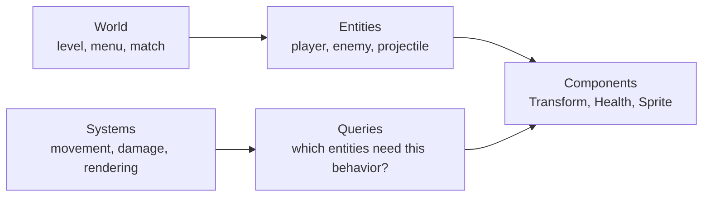
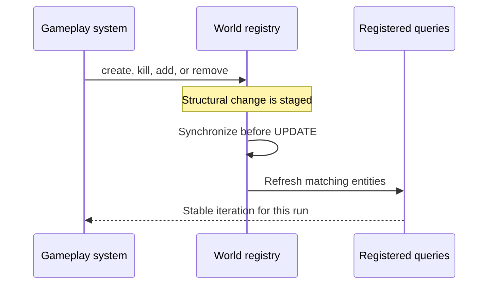

# ECS: build gameplay from data

Arepy uses an Entity Component System (ECS) to keep game data separate from the
code that changes it. The idea is easier than the name suggests:

- an **entity** identifies one thing in the game;
- **components** describe that thing with data;
- **systems** run the behavior;
- a **query** chooses which entities a system should process;
- a **world** keeps those pieces together for one scene or game state.



This composition is the important part. A player does not need a large
`Player` class that owns movement, health, graphics, input, and sound. It can be
an entity with the components required by the systems that should act on it.

## The five terms you need

| Term | Think of it as | Example |
| --- | --- | --- |
| World | One self-contained game context | `main_menu`, `level_1`, `battle` |
| Entity | A lightweight identity | the player, one bunny, one camera |
| Component | Data attached to an entity | position, velocity, health |
| System | A function that reads or changes data | movement, damage, drawing |
| Query | A sentence that selects data | “everything with health” |

### World

A `World` owns its entities, component storage, systems, queries, and
world-specific resources. It is a useful boundary for a scene: switching from a
menu world to a game world also switches the ECS state and systems being run.

Create worlds through the engine:

```python
from arepy import ArepyEngine


game = ArepyEngine(title="My game", width=960, height=540)
world = game.create_world("level_1")
game.set_current_world("level_1")
```

Resources added with `world.add_resource(...)` belong to that world. Resources
added to the engine are shared by its worlds. See [resources](resources.md) for
state that does not naturally belong to a single entity.

### Entity

An entity is a handle, not a Python game-object hierarchy. Its identity contains
a compact numeric slot and a generation. Components give that identity meaning:

```python
from arepy.bundle.components.rigidbody import RigidBody2D
from arepy.bundle.components.transform import Transform
from arepy.math import Vec2


player = (
    world.create_entity()
    .with_component(Transform(position=Vec2(120, 240)))
    .with_component(RigidBody2D(velocity=Vec2(0, 0)))
    .build()
)
```

`world.create_entity()` returns an `EntityBuilder`. Add one instance of each
component type and finish with `build()` to get the `Entity` handle.

Keep a handle only while that entity is alive. After `entity.kill()`, discard
the handle. A future entity may reuse the same numeric slot, but it is a new
generation and therefore a different entity.

### Component

A component is a small data holder derived from `Component`. Custom gameplay
components can be ordinary Python classes:

```python
from arepy.ecs import Component


class Health(Component):
    def __init__(self, current: float, maximum: float) -> None:
        super().__init__()
        self.current = current
        self.maximum = maximum
```

Once defined, it composes with the existing entity without changing that
entity's type:

```python
player.add_component(Health(current=100, maximum=100))
```

Prefer focused components over one class containing every possible field.
`Health`, `Team`, and `Damage` can evolve independently and can be combined on
different kinds of entities.

Shared objects such as textures, audio banks, level configuration, or a score
manager usually belong in the asset store or a resource, rather than being
duplicated on every entity.

### System

A system is a function registered in a pipeline. Arepy reads its type
annotations when the system is registered, then supplies the matching query and
resources when it runs.

```python
from arepy import SystemPipeline, Time
from arepy.ecs import Entity, Query, With


def damage_over_time(
    query: Query[Entity, With[Health]],
    time: Time,
) -> None:
    damage = 5.0 * time.delta_seconds

    for entity, health in query.iter_entities_components(Health):
        health.current = max(0.0, health.current - damage)
        if health.current == 0.0:
            entity.kill()


world.add_system(SystemPipeline.UPDATE, damage_over_time)
```

Read the annotation as a sentence: this system needs every entity **with** a
`Health` component, plus the world's `Time` resource. You do not create the
`Query` or pass arguments yourself.

The pipelines used in a normal frame are:

| Pipeline | Use it for |
| --- | --- |
| `INPUT` | reading controls and turning them into game intent |
| `UPDATE` | gameplay, movement, timers, and state changes |
| `RENDER` | drawing the world |
| `RENDER_UI` | ImGui and other UI drawn over the world |

Use world hooks such as `@world.on_startup` for scene-level setup and teardown.
Use systems when behavior naturally applies to a group of entities.

### Query

A query is the bridge between data and behavior. It keeps the system focused on
the entities that have the right component combination. For example:

```python
Query[Entity, With[Transform, RigidBody2D]]
```

means “entities that have both a transform and a 2D rigid body.” Queries are
described in depth in [Queries](queries.md).

## Structural changes are synchronized safely

Creating or killing an entity, or adding or removing a component, changes the
shape of the ECS. Arepy stages these structural changes and synchronizes query
membership at a safe point before the `UPDATE` pipeline.



This lets a system call `entity.kill()` while iterating without changing the
collection underneath the loop. The entity is removed from queries at the next
synchronization point. A structural change made after that point in a frame is
normally observed on the following frame; a change made in `INPUT` happens
before synchronization and can be observed by `UPDATE` in the same frame.

Do not write gameplay that depends on a query rebuilding halfway through its
current loop. Treat structural operations as requests that become visible at
the next synchronization point.

## What pooling and generations actually reuse

Entity churn is common in games: bullets expire, enemies die, and particles are
replaced. Arepy keeps storage pools so those lifecycles do not continually grow
the registry.

When an entity is killed and the registry synchronizes:

1. the entity is removed from registered queries;
2. its component references are cleared from their existing pool slots;
3. its entity slot is released and its generation is incremented;
4. a later spawn can reuse that entity ID and the already allocated component
   pool capacity.

The generation matters because an old handle must never become a handle to the
new entity merely because their numeric IDs match.

!!! important "Storage is reused; Python component instances are not resurrected"

    Recycling reuses entity IDs, component slots, and allocated pool capacity.
    It does **not** reset the old `Health`, `Transform`, or other Python object and
    hand that same instance to the next entity. When you respawn, the component
    values passed to `with_component(...)` are new values stored in the recycled
    slots.

Pooling makes legitimate spawn/despawn cycles cheaper, but structural changes
still have work to do. If an object can remain logically alive—an inactive
particle waiting to be reset, for example—reusing that entity and mutating its
existing components can be even cheaper. When it truly dies, `kill()` is the
correct operation and the ECS will recycle its storage safely.

## A practical way to design a feature

When adding gameplay, work in this order:

1. Name the facts that must be stored, then create small components for them.
2. Build entities by composing those component values.
3. Write each behavior as a system with a query that says exactly what it needs.
4. Put shared state in resources and loaded files in the asset store.
5. Choose [`Query` or `BatchQuery`](queries.md#query-or-batchquery) based on the
   work, then measure before optimizing further.

The result stays readable as the game grows: entities describe *what exists*,
components describe *what it knows*, and systems describe *what happens*.
