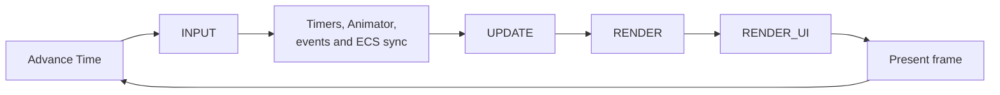

# Engine lifecycle and pipelines

A game frame is easier to reason about when input, simulation, drawing, and
debug UI happen in a predictable order.



## The four pipelines in the normal loop

| Pipeline | Put this here | Typical dependencies |
| --- | --- | --- |
| `INPUT` | Read controls and turn them into intent. | `Input`, player state. |
| `UPDATE` | Movement, rules, AI, spawning, damage. | `Query`, `Time`, resources. |
| `RENDER` | Start, clear, draw, and end the game frame. | `Renderer2D` or `Renderer3D`. |
| `RENDER_UI` | Describe optional ImGui tools. | `imgui`, debug resources. |

Register systems individually when their order matters:

```python
world.add_system(SystemPipeline.INPUT, read_controls)
world.add_system(SystemPipeline.UPDATE, move_player)
world.add_system(SystemPipeline.UPDATE, resolve_collisions)
world.add_system(SystemPipeline.RENDER, draw_scene)
```

The enum also exposes `PHYSICS` and `ASYNC_UPDATE`, but the standard engine loop
does not execute those two pipelines automatically. Treat them as extension
points, not normal beginner phases.

## Creating the application

```python
from arepy import ArepyEngine, WindowFlag


engine = ArepyEngine(
    title="Space Garden",
    width=1280,
    height=720,
    max_frame_rate=144,
    window_flags=WindowFlag.WINDOW_RESIZABLE,
)
world = engine.create_world("level_one")

engine.set_current_world("level_one")
engine.run()
```

The constructor opens the window and initializes the renderer, input, audio,
asset store, clock, and optional ImGui integration. Create long-lived resources
and load assets before `run()` whenever possible.

## World lifecycle callbacks

World hooks are good ownership boundaries for setup and cleanup:

```python
@world.on_startup
def enter_level() -> None:
    start_level_music()


@world.on_shutdown
def leave_level() -> None:
    unload_level_assets()
```

Available hooks are:

- `on_startup`: when the world becomes active;
- `on_update`: after its `UPDATE` systems;
- `on_render`: after `RENDER` and `RENDER_UI` systems;
- `on_shutdown`: before switching away or closing.

Prefer ECS systems for work over many entities. Use hooks for scene ownership,
orchestration, and one-time actions.

## World switching is deferred

```python
engine.create_world("menu")
engine.create_world("level_one")

engine.set_current_world("menu")
```

Calling `set_current_world()` requests the next world. The engine completes the
current frame boundary, sends `on_shutdown` to the old world, then sends
`on_startup` to the new one. Code already running does not suddenly change
world halfway through a system.

## Structural ECS changes are synchronized

Entity creation, component changes, and `entity.kill()` update query membership
at an ECS synchronization point. In the standard loop that synchronization
happens before `UPDATE` systems.

This means a killed entity should not be assumed to disappear from every query
in the middle of the same pipeline. Mark it with data if later systems in that
frame must ignore it immediately; let the registry finalize the structural
change at the next synchronization.

For the memory-reuse details, continue to [ECS basics](ecs.md). For typed
services, see [Engine services](engine-services.md).
