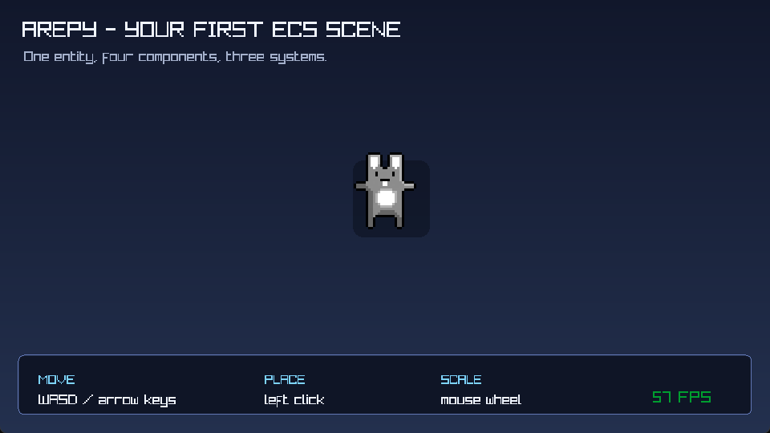
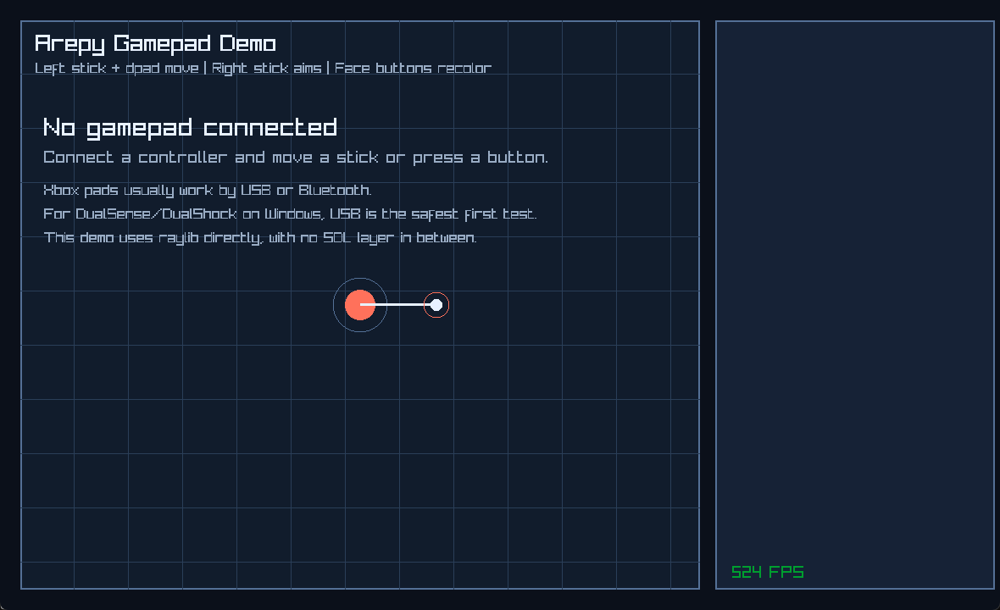
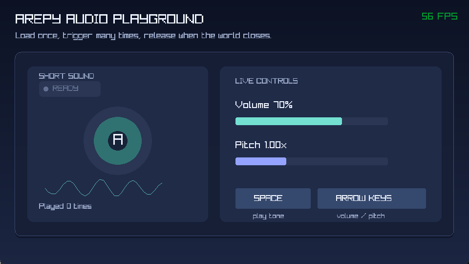
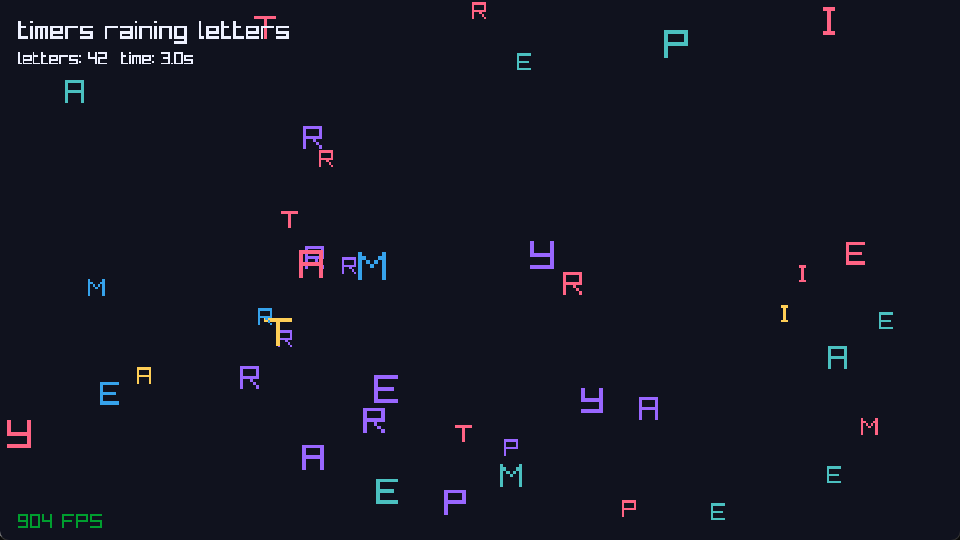
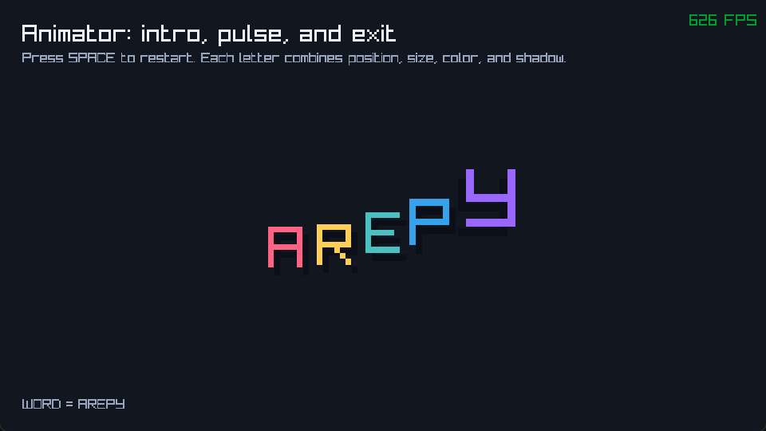
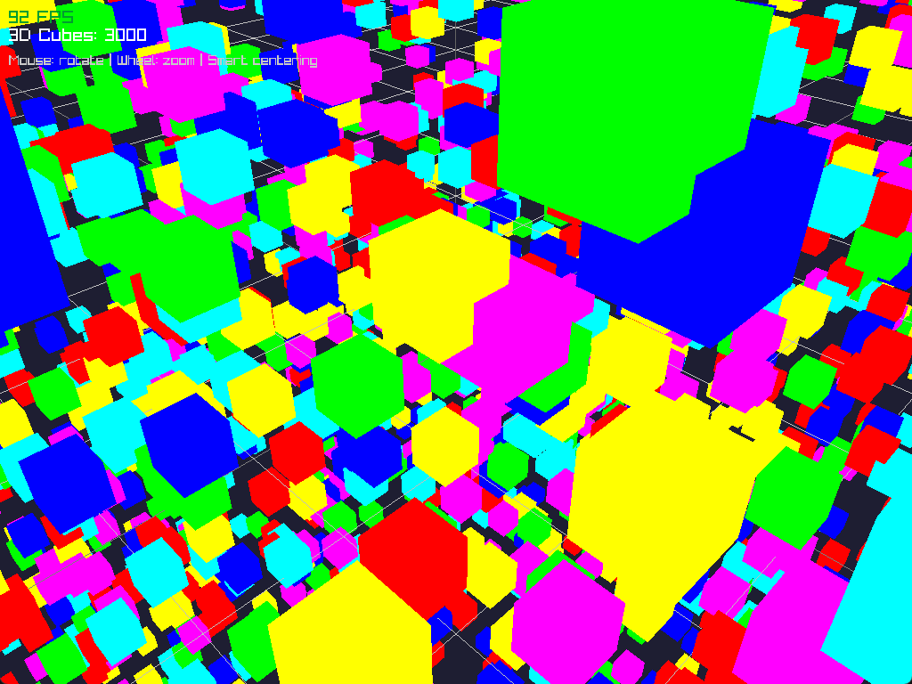
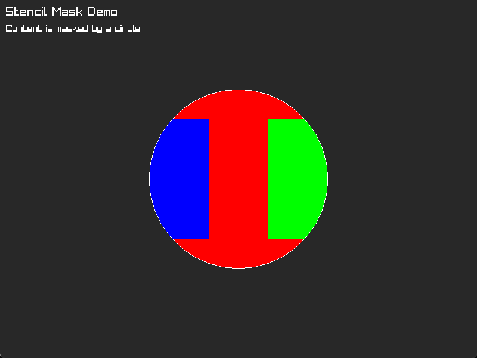
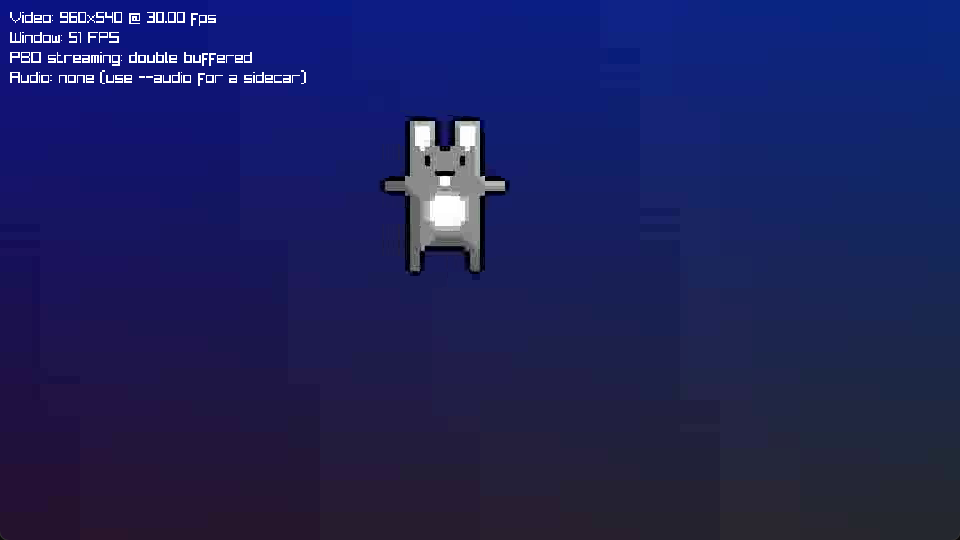
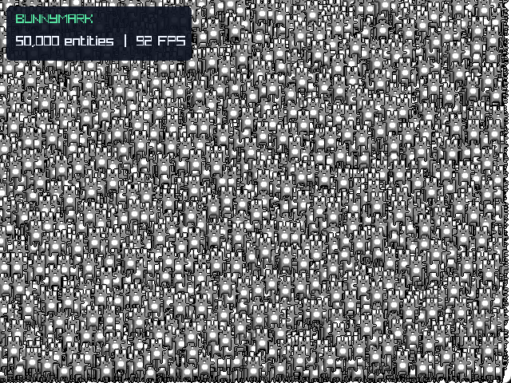

# Examples and recipes

The examples are small programs you can run and change. Start with the one that
matches the question you are trying to answer; BunnyMark is intentionally a
stress test, not a tutorial.

Run commands from the repository root:

```bash
uv run python examples/getting_started.py
```

## Learning path

| Example | What it teaches | Extra dependency |
| --- | --- | --- |
| `getting_started.py` | Bunny, ECS, keyboard, mouse, textures, reusable draw data. | None |
| `imgui_minimal.py` | A live development panel in `RENDER_UI`. | `imgui` |
| `gamepad_demo.py` | Detection, sticks, triggers, buttons, deadzones, vibration. | None |
| `audio_demo.py` | Load once, play, adjust volume and pitch, clean up. | None |
| `timer_letters.py` | World-local timers and cooldowns. | None |
| `animator_letters.py` | Timelines and lightweight property animation. | None |
| `cubemark_3d.py` | 3D camera and a large `Query`-driven cube workload. | None |
| `stencil_demo.py` | Masked 2D drawing when stencil support is available. | None |
| `video_demo.py` | PBO texture streaming from a user-supplied video. | `video` |
| `bunnymark.py` | `BatchQuery`, NumPy, texture atlas, and FPS under load. | None |

## First bunny

{ .arepy-screenshot }

Use this example to learn the engine loop. Its values and draw objects are kept
alive and mutated; assets are loaded before the loop.

```bash
uv run python examples/getting_started.py
```

## ImGui panel

{ .arepy-screenshot }

```bash
uv sync --extra imgui
uv run python examples/imgui_minimal.py
```

The example builds a normal ImGui window in `RENDER_UI`. Arepy starts the ImGui
frame and submits the finished draw data.

## Gamepad explorer

{ .arepy-screenshot }

```bash
uv run python examples/gamepad_demo.py
```

The window also explains the disconnected state, then updates when a controller
becomes available.

## Audio controls

{ .arepy-screenshot }

```bash
uv run python examples/audio_demo.py
```

The example generates its short demonstration tone during setup, loads it once,
and makes playback state visible.

## Timers and cooldowns

{ .arepy-screenshot }

```bash
uv run python examples/timer_letters.py
```

This example turns timer callbacks into visible behavior: individual letters
rain into the scene, bounce, and leave room for recycled entity slots.

## Animator timelines

{ .arepy-screenshot }

```bash
uv run python examples/animator_letters.py
```

Press Space to replay the sequence. The timeline is created when the animation
starts; the render loop reads the existing letter state.

## CubeMark 3D

{ .arepy-screenshot }

```bash
uv run python examples/cubemark_3d.py
```

CubeMark is the 3D stress example. It uses normal `Query` iteration for cube
movement and drawing, so it is useful for understanding where Python-side
per-entity work becomes visible.

## Stencil mask

{ .arepy-screenshot }

```bash
uv run python examples/stencil_demo.py
```

Stencil initialization is attempted once when the world starts. The screenshot
shows which parts of the red, blue, and green rectangles survive the circular
mask.

## Video streaming

{ .arepy-screenshot }

```bash
uv sync --extra video
uv run python examples/video_demo.py path/to/video.mp4 --silent
```

The repository does not include a large sample video, so the input path is
explicit. Add `--audio path/to/track.ogg` for a sidecar track; omit `--silent`
to let the example discover a sidecar with the same stem. Decoding happens in
`UPDATE`, while `RENDER` draws the already-uploaded streaming texture.

## BunnyMark

{ .arepy-screenshot }

```bash
uv run python examples/bunnymark.py
```

The default count is deliberately large. Change `BUNNY_COUNT` while learning
or profiling on slower hardware. Use the benchmark harness for repeatable ECS
comparisons; use BunnyMark to observe an integrated render workload.

## The structure shared by the examples

Read each file from setup to shutdown. When turning an example into a game, use
this sequence:

1. Constants and resource objects are created once.
2. The engine and world are created.
3. Assets are loaded and entities are spawned.
4. Systems are registered by pipeline.
5. The world is selected and the engine runs.
6. The owner releases resources that have an explicit unload operation.

## Ownership when adapting an example

The engine's `AssetStore` is shared by all worlds. It does not automatically
unload an asset when one world closes, so decide who owns every loaded handle:

- A level-owned sound, texture, model, mesh, or material is loaded for that
  level and released in `world.on_shutdown` with the corresponding
  `AssetStore.unload_*()` method.
- An asset shared by several worlds stays loaded until the final user is done;
  an application-level owner releases it during application shutdown.
- A custom font is not loaded through `AssetStore`. Keep the `ArepyFont`
  returned by `Renderer2D.load_font_ex()` and release it with
  `Renderer2D.unload_font()`.
- Objects such as `Color`, `Rect`, cameras, and state resources are ordinary
  reusable Python objects; create them during setup and mutate them instead of
  replacing them in a per-entity frame loop.

Small demonstration programs may rely on process exit after the window closes.
When copying their setup into a multi-world game or a repeatedly loaded scene,
add the explicit lifecycle ownership described above.

If you want the concepts behind that pattern, return to
[Your first bunny game](../getting-started/quickstart.md).
