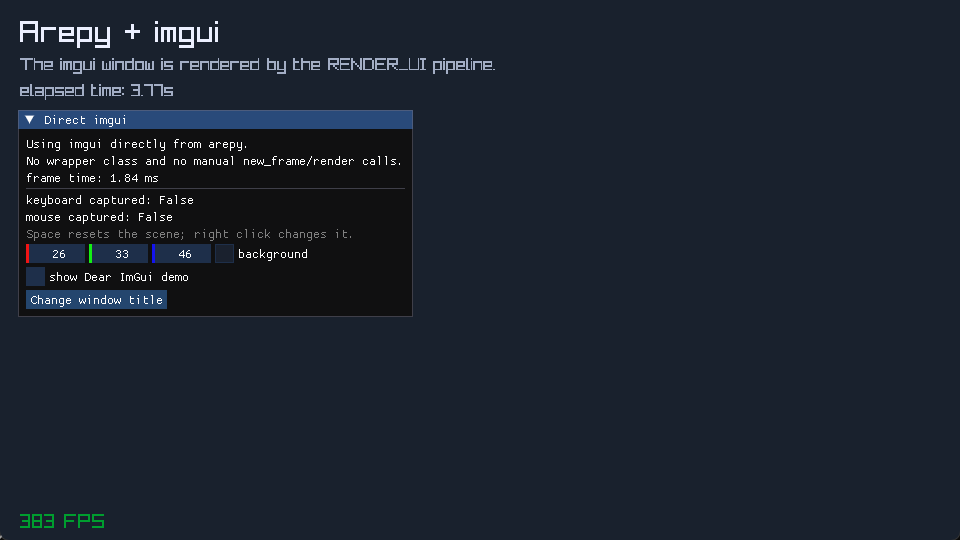

# Debug tools with ImGui

Dear ImGui is ideal for information that helps you build the game but is not
part of the final game UI: entity inspectors, live values, profilers, spawn
buttons, and editor tools.

{ .arepy-screenshot }
<p class="arepy-caption">The scene is drawn in <code>RENDER</code>; the debug window is described in <code>RENDER_UI</code>.</p>

## Install the optional extra

=== "pip"

    ```bash
    pip install "arepy[imgui]"
    ```

=== "uv"

    ```bash
    uv add "arepy[imgui]"
    ```

Inside the Arepy repository, use `uv sync --extra imgui`.

## The immediate-mode mental model

With retained UI toolkits, you create a button object and keep it alive. With
ImGui, your code describes the desired window again each frame:

```python
if imgui.button("Spawn bunny"):
    spawn_bunny()
```

The call draws the button and returns `True` only on the frame it was clicked.
Your game owns the meaningful state; ImGui owns short-lived interaction state.

## A complete panel

Keep panel state in a world resource instead of module globals:

```python
from dataclasses import dataclass, field

from arepy import Display, Time, imgui


@dataclass(slots=True)
class DebugPanel:
    visible: bool = True
    background: list[float] = field(
        default_factory=lambda: [0.10, 0.13, 0.18]
    )


def debug_ui(panel: DebugPanel, display: Display, time: Time) -> None:
    if not panel.visible:
        return

    expanded, panel.visible = imgui.begin("Arepy debug", panel.visible)
    if expanded:
        imgui.text(f"Frame time: {time.delta_seconds * 1000.0:.2f} ms")
        _, panel.background = imgui.color_edit3(
            "Background",
            panel.background,
        )

        if imgui.button("Rename window"):
            display.set_window_title("Debugging Arepy")
    imgui.end()
```

Register the resource and system once:

```python
panel = DebugPanel()
world.add_resource(panel)
world.add_system(SystemPipeline.RENDER_UI, debug_ui)
```

## What Arepy manages

Arepy's ImGui integration already:

1. forwards keyboard and mouse state to the backend;
2. starts a new ImGui frame;
3. runs `RENDER_UI` systems;
4. builds and submits the draw data.

Do not call `imgui.new_frame()` or `imgui.render()` yourself. Import the module
directly with `from arepy import imgui`; a wrapper is not required.

## Prevent UI input from controlling the game

When the user is typing or dragging a panel, let ImGui consume that device:

```python
def player_input(input_device: Input) -> None:
    io = imgui.get_io()

    if not io.want_capture_keyboard:
        read_movement_keys(input_device)

    if not io.want_capture_mouse:
        read_aiming_mouse(input_device)
```

This check belongs in shared keyboard/mouse handling. A game that never places
ImGui over interactive gameplay does not need it.

## Useful first widgets

| Widget | Use |
| --- | --- |
| `imgui.text()` | Metrics and labels. |
| `imgui.button()` | Trigger a one-shot action. |
| `imgui.checkbox()` | Toggle a boolean. |
| `imgui.slider_float()` | Tune speed, volume, or timing live. |
| `imgui.color_edit3()` | Tune RGB colors. |
| `imgui.show_demo_window()` | Explore the widgets included with Dear ImGui. |

Every successful `imgui.begin()` must be paired with `imgui.end()`, even when
the window is collapsed.

## Where ImGui belongs

Use ImGui for development tools and inspectors. For a shipped title screen,
HUD, or diegetic interface, draw your own game UI through `Renderer2D` so it
matches the game's art and works on every target.

!!! note "Development-time support"

    ImGui is available in the desktop development environment when the optional
    extra is installed. The current web target disables it, and the current
    Windows one-file builder excludes the ImGui stack. Use it as a development
    tool unless your own packaging pipeline explicitly includes its backend.

Run [`examples/imgui_minimal.py`](https://github.com/Scr44gr/arepy/blob/main/examples/imgui_minimal.py)
for the scene shown above.
