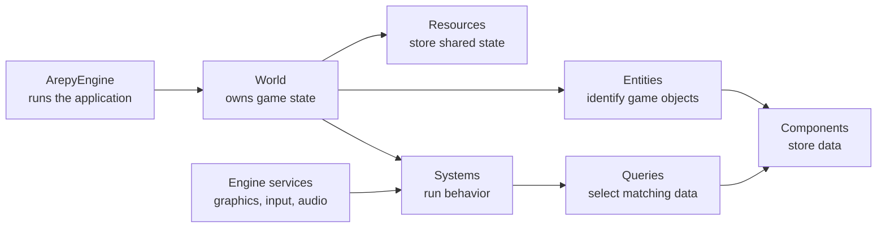

# How Arepy Fits Together

Arepy separates **what a game object is** from **what happens to it**. An entity gives the object an identity, components hold its data, and systems apply behavior. A world brings those pieces together and the engine runs that world frame after frame.

Think of the diagram as a map, not a checklist. The quickstart introduces each piece only when the game needs it.

## A concrete example

Imagine a bunny moving across the screen:

| Piece | In the bunny game |
| --- | --- |
| Entity | The bunny's unique identity |
| Components | Its transform, velocity, and sprite data |
| System | Code that moves or draws every matching bunny |
| Query | The request for entities that have the needed components |
| Resource | Shared state such as the loaded bunny texture |
| World | The entities, systems, and shared state for this game scene |
| Engine service | The renderer, input device state, audio device, or clock |

The result is gameplay code that can say “move everything with a transform and velocity” without maintaining a separate Python object for every kind of thing in the game.

## Read by goal

-   :material-shape-plus-outline: __Organize game state__

    Start with [entities, components, and systems](ecs.md), then learn when shared state belongs in [resources](resources.md).

-   :material-refresh: __Understand each frame__

    Follow the [engine lifecycle](engine-lifecycle.md) from startup through update, drawing, and shutdown.

-   :material-image-multiple-outline: __Build the playable layer__

    Continue with [graphics](graphics.md), [input](input.md), [audio](audio.md), and the [built-in bundle](bundle.md).

-   :material-database-search-outline: __Work with lots of entities__

    Learn [queries and batch queries](queries.md), then see how [recycling and storage](performance.md) affect frame time.

-   :material-tools: __Add development tools__

    Create live inspectors and tuning panels with [Dear ImGui](imgui.md), then browse the [complete examples](examples.md).

-   :material-package-up: __Share the game__

    Use the [game builder](builder.md) when the project is ready to leave your development environment.

## Where should new code go?

- Put per-entity state in a **component**.
- Put behavior that applies to matching entities in a **system**.
- Put state shared by many systems in a world **resource**.
- Use an engine **service** for a platform capability such as drawing, input, audio, or timing.
- Use a **query** to select data; use `BatchQuery` when an array-oriented update is a better fit than processing one entity at a time.

These are guidelines, not hoops to jump through. Small games can stay small, and you can introduce more structure only when it makes the code easier to reason about.
