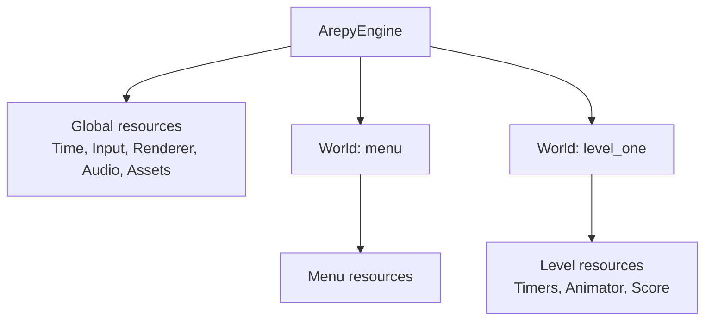

# Resources and system dependencies

Components describe individual entities. Resources describe state or services
shared by many entities: the renderer, input device, level score, settings, or
spawn director.



## Ask for what a system needs

Type annotations are dependencies, not decoration:

```python
from arepy import Input, Renderer2D, Time


def player_system(
    query: Query[Entity, With[Player, Transform]],
    input_device: Input,
    renderer: Renderer2D,
    time: Time,
) -> None:
    ...
```

Arepy creates the query and supplies the three resources when it runs the
system. The signature remains a useful summary when you return to the code
months later.

## Global resources

The engine registers one shared instance of:

- `Display`
- `Time`
- `Renderer2D` and `Renderer3D`
- `AssetStore`
- `Input`
- `AudioDevice`
- `EventManager`
- `ArepyEngine`
- `imgui`, when the optional extra is installed

Add your own application-wide object with `engine.add_resource()`:

```python
from dataclasses import dataclass


@dataclass(slots=True)
class GameSettings:
    difficulty: str = "normal"
    master_volume: float = 0.8


engine.add_resource(GameSettings())
```

Any world's system can now request `GameSettings`.

## World-local resources

Use a local resource when its state belongs to one scene and should disappear
with that scene:

```python
@dataclass(slots=True)
class LevelState:
    score: int = 0
    remaining_bunnies: int = 12


level = engine.create_world("level_one")
level.add_resource(LevelState())


def score_system(state: LevelState) -> None:
    state.score += 10
```

Every world already has local `Timers` and `Animator` resources. When a local
and global resource share the same type name, the local one is supplied to that
world's systems.

## Choosing the right home

| Data | Put it in |
| --- | --- |
| Position or health of one entity | Component |
| Score for one level | World resource |
| Spawn settings for one scene | World resource |
| Renderer, input, assets, audio | Engine resource (already registered) |
| User settings shared by menus and levels | Engine resource |
| Temporary local variable used by one function | Normal Python local |

Avoid turning every value into a resource. A resource is useful when several
systems need the same long-lived object or when it defines clear ownership.

## Manual lookup during setup

Outside systems, fetch by type:

```python
renderer = engine.get_resource(Renderer2D)
timers = world.get_world_resource(Timers)
settings = world.get_resource(GameSettings)
```

`world.get_resource()` searches local resources first and then global ones.
Use the more explicit `get_world_resource()` or `get_global_resource()` when
you want to enforce where an object must live.

Do not repeat these lookups for every entity inside a hot loop. Request the
resource once as a system argument, then reuse that local reference.

## Ownership and cleanup

A resource can own loaded assets or external handles. Pair its lifetime with a
world hook:

```python
@world.on_startup
def load_level_audio() -> None:
    ...


@world.on_shutdown
def unload_level_audio() -> None:
    ...
```

The engine does not guess whether a custom resource belongs to one scene or the
whole application. Choosing global versus world-local makes that lifetime
explicit.

Next: review the built-in [engine services](engine-services.md) or learn how
[queries](queries.md) select entity data.
